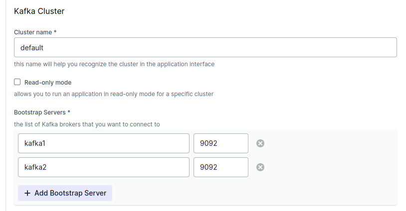
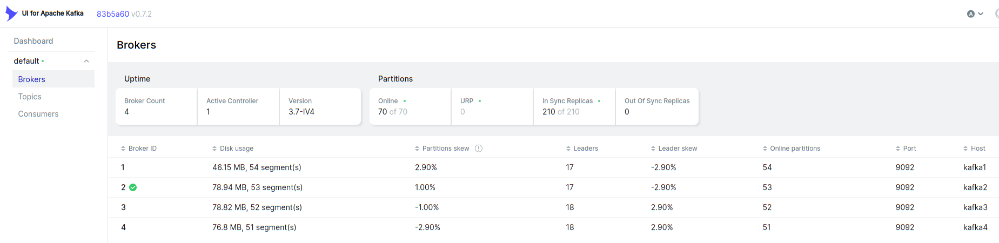
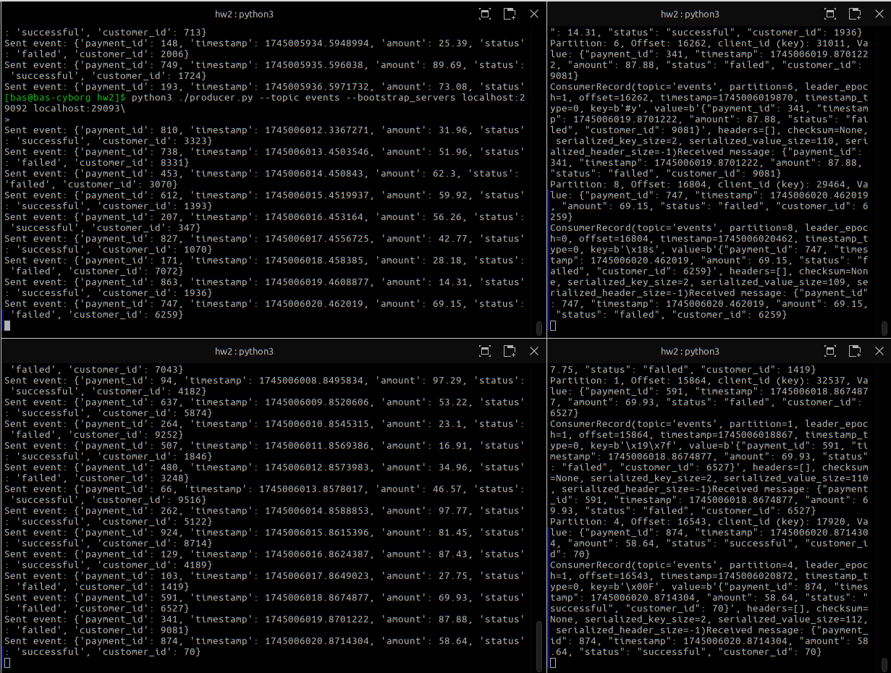

### День 2  
Для запуска кластера Kafka небходимо перейти в подпапку **_nats-cluster_** и выполнить команду
```shell
cd ./kafka-kraft-cluster
docker compose up -d
```
Данный compose запустит кластер из 4 узлов, не используя Zookeeper. 
Вместе c docker compose поставляется kafka ui в котором необходимо настроить подключение к кластеру

Интерфейс отображает информацию о лидере, партициях и пр.


### Цель
- Run manually configured Kafka Cluster with 3+ instances
- Use either Zookeper or KRaft
- Create simulated stream workload (logs, payments, clicks, etc.)
- Create consumers
- Simulate outage of minority, observe availability
- Simulate outage of majority, observe unavailability


Запуск producer

```shell
python3 ./producer.py --topic events --bootstrap_servers localhost:29092 localhost:29093
```
```text
Sent event: {'payment_id': 246, 'timestamp': 1745004769.2979138, 'amount': 30.83, 'status': 'failed', 'customer_id': 3391}
Sent event: {'payment_id': 741, 'timestamp': 1745004770.410652, 'amount': 40.03, 'status': 'successful', 'customer_id': 294}
Sent event: {'payment_id': 908, 'timestamp': 1745004771.4133697, 'amount': 44.2, 'status': 'failed', 'customer_id': 4429}
Sent event: {'payment_id': 7, 'timestamp': 1745004772.4144435, 'amount': 46.62, 'status': 'successful', 'customer_id': 8949}
Sent event: {'payment_id': 719, 'timestamp': 1745004773.415487, 'amount': 71.54, 'status': 'failed', 'customer_id': 4055}
Sent event: {'payment_id': 964, 'timestamp': 1745004774.4166331, 'amount': 25.63, 'status': 'successful', 'customer_id': 7317}
Sent event: {'payment_id': 614, 'timestamp': 1745004775.4177034, 'amount': 16.19, 'status': 'successful', 'customer_id': 3632}
Sent event: {'payment_id': 263, 'timestamp': 1745004776.4187746, 'amount': 46.2, 'status': 'failed', 'customer_id': 5401}
Sent event: {'payment_id': 515, 'timestamp': 1745004777.4198868, 'amount': 37.22, 'status': 'successful', 'customer_id': 5513}
Sent event: {'payment_id': 509, 'timestamp': 1745004778.4225187, 'amount': 22.6, 'status': 'successful', 'customer_id': 6574}
Sent event: {'payment_id': 563, 'timestamp': 1745004779.4250255, 'amount': 72.87, 'status': 'successful', 'customer_id': 2313}
Sent event: {'payment_id': 223, 'timestamp': 1745004780.4274116, 'amount': 47.85, 'status': 'failed', 'customer_id': 836}
Sent event: {'payment_id': 977, 'timestamp': 1745004781.4277453, 'amount': 24.3, 'status': 'failed', 'customer_id': 5177}
Sent event: {'payment_id': 612, 'timestamp': 1745004782.4288368, 'amount': 61.36, 'status': 'successful', 'customer_id': 4438}
Sent event: {'payment_id': 573, 'timestamp': 1745004783.4299412, 'amount': 53.49, 'status': 'failed', 'customer_id': 3144}
Sent event: {'payment_id': 66, 'timestamp': 1745004784.430997, 'amount': 20.52, 'status': 'successful', 'customer_id': 2674}
Sent event: {'payment_id': 689, 'timestamp': 1745004785.4328864, 'amount': 97.73, 'status': 'failed', 'customer_id': 539}
Sent event: {'payment_id': 79, 'timestamp': 1745004786.4340632, 'amount': 74.47, 'status': 'failed', 'customer_id': 6478}
Sent event: {'payment_id': 631, 'timestamp': 1745004787.4351277, 'amount': 99.51, 'status': 'failed', 'customer_id': 7176}
```

Запуск consumer
```shell
python3 ./consumer.py --topic events --bootstrap_servers localhost:29092 localhost:29093
```

```text
Partition: 2, Offset: 16836, client_id (key): 44569, Value: {"payment_id": 509, "timestamp": 1745004778.4225187, "amount": 22.6, "status": "successful", "customer_id": 6574}
ConsumerRecord(topic='events', partition=2, leader_epoch=0, offset=16836, timestamp=1745004778422, timestamp_type=0, key=b'\x19\xae', value=b'{"payment_id": 509, "timestamp": 1745004778.4225187, "amount": 22.6, "status": "successful", "customer_id": 6574}', headers=[], checksum=None, serialized_key_size=2, serialized_value_size=113, serialized_header_size=-1)Received message: {"payment_id": 509, "timestamp": 1745004778.4225187, "amount": 22.6, "status": "successful", "customer_id": 6574}
Partition: 2, Offset: 16837, client_id (key): 18444, Value: {"payment_id": 573, "timestamp": 1745004783.4299412, "amount": 53.49, "status": "failed", "customer_id": 3144}
ConsumerRecord(topic='events', partition=2, leader_epoch=0, offset=16837, timestamp=1745004783430, timestamp_type=0, key=b'\x0cH', value=b'{"payment_id": 573, "timestamp": 1745004783.4299412, "amount": 53.49, "status": "failed", "customer_id": 3144}', headers=[], checksum=None, serialized_key_size=2, serialized_value_size=110, serialized_header_size=-1)Received message: {"payment_id": 573, "timestamp": 1745004783.4299412, "amount": 53.49, "status": "failed", "customer_id": 3144}
Partition: 3, Offset: 17300, client_id (key): 6914, Value: {"payment_id": 689, "timestamp": 1745004785.4328864, "amount": 97.73, "status": "failed", "customer_id": 539}
ConsumerRecord(topic='events', partition=3, leader_epoch=0, offset=17300, timestamp=1745004785433, timestamp_type=0, key=b'\x02\x1b', value=b'{"payment_id": 689, "timestamp": 1745004785.4328864, "amount": 97.73, "status": "failed", "customer_id": 539}', headers=[], checksum=None, serialized_key_size=2, serialized_value_size=109, serialized_header_size=-1)Received message: {"payment_id": 689, "timestamp": 1745004785.4328864, "amount": 97.73, "status": "failed", "customer_id": 539}
Partition: 2, Offset: 16838, client_id (key): 2076, Value: {"payment_id": 631, "timestamp": 1745004787.4351277, "amount": 99.51, "status": "failed", "customer_id": 7176}
ConsumerRecord(topic='events', partition=2, leader_epoch=0, offset=16838, timestamp=1745004787435, timestamp_type=0, key=b'\x1c\x08', value=b'{"payment_id": 631, "timestamp": 1745004787.4351277, "amount": 99.51, "status": "failed", "customer_id": 7176}', headers=[], checksum=None, serialized_key_size=2, serialized_value_size=110, serialized_header_size=-1)Received message: {"payment_id": 631, "timestamp": 1745004787.4351277, "amount": 99.51, "status": "failed", "customer_id": 7176}
```
Просмотр статуса кластера до отключения одного из узлов
```text
/opt/bitnami/kafka/bin/kafka-metadata-quorum.sh --bootstrap-server  kafka1:9092 describe --status
ClusterId:              fsdfkdsfkdsfsd
LeaderId:               3
LeaderEpoch:            1
HighWatermark:          332647
MaxFollowerLag:         0
MaxFollowerLagTimeMs:   342
CurrentVoters:          [1,2,3,4]
CurrentObservers:       []
I have no name!@03fd1ebfcf64:/$ 
```

Эмуляция отказа одного узла
```shell
docker stop kafka3
```

```text
/opt/bitnami/kafka/bin/kafka-metadata-quorum.sh --bootstrap-server  kafka4:9092 describe --status
ClusterId:              fsdfkdsfkdsfsd
LeaderId:               1
LeaderEpoch:            2
HighWatermark:          333749
MaxFollowerLag:         333750
MaxFollowerLagTimeMs:   -1
CurrentVoters:          [1,2,3,4]
CurrentObservers:       []
```

Из вывода видно, что лидер переместился с узла 3 на узел 1.
На работу producer и consumer отключение одного узла не повлияло


Эмуляция отказа двух узлов
```shell
docker stop kafka2
```
Лог файл узла kafka4

```text
[2025-04-18 19:58:38,393] WARN [RaftManager id=4] Error connecting to node kafka3:9093 (id: 3 rack: null) (org.apache.kafka.clients.NetworkClient)
2025-04-18T19:58:38.398928000Z java.net.UnknownHostException: kafka3
2025-04-18T19:58:38.399110000Z 	at java.base/java.net.InetAddress$CachedAddresses.get(InetAddress.java:801)
2025-04-18T19:58:38.399317000Z 	at java.base/java.net.InetAddress.getAllByName0(InetAddress.java:1533)
2025-04-18T19:58:38.399478000Z 	at java.base/java.net.InetAddress.getAllByName(InetAddress.java:1385)
2025-04-18T19:58:38.399646000Z 	at java.base/java.net.InetAddress.getAllByName(InetAddress.java:1306)
2025-04-18T19:58:38.399808000Z 	at org.apache.kafka.clients.DefaultHostResolver.resolve(DefaultHostResolver.java:27)
2025-04-18T19:58:38.399987000Z 	at org.apache.kafka.clients.ClientUtils.resolve(ClientUtils.java:124)
2025-04-18T19:58:38.400172000Z 	at org.apache.kafka.clients.ClusterConnectionStates$NodeConnectionState.resolveAddresses(ClusterConnectionStates.java:536)
2025-04-18T19:58:38.400346000Z 	at org.apache.kafka.clients.ClusterConnectionStates$NodeConnectionState.currentAddress(ClusterConnectionStates.java:511)
2025-04-18T19:58:38.400513000Z 	at org.apache.kafka.clients.ClusterConnectionStates$NodeConnectionState.access$200(ClusterConnectionStates.java:466)
2025-04-18T19:58:38.400696000Z 	at org.apache.kafka.clients.ClusterConnectionStates.currentAddress(ClusterConnectionStates.java:173)
2025-04-18T19:58:38.400861000Z 	at org.apache.kafka.clients.NetworkClient.initiateConnect(NetworkClient.java:1050)
2025-04-18T19:58:38.401019000Z 	at org.apache.kafka.clients.NetworkClient.ready(NetworkClient.java:310)
2025-04-18T19:58:38.401224000Z 	at org.apache.kafka.server.util.InterBrokerSendThread.sendRequests(InterBrokerSendThread.java:145)
2025-04-18T19:58:38.401380000Z 	at org.apache.kafka.server.util.InterBrokerSendThread.pollOnce(InterBrokerSendThread.java:108)
2025-04-18T19:58:38.401546000Z 	at org.apache.kafka.server.util.InterBrokerSendThread.doWork(InterBrokerSendThread.java:136)
2025-04-18T19:58:38.401712000Z 	at org.apache.kafka.server.util.ShutdownableThread.run(ShutdownableThread.java:135)
2025-04-18T19:58:38.885936000Z [2025-04-18 19:58:38,885] INFO [RaftManager id=4] Election has timed out, backing off for 0ms before becoming a candidate again (org.apache.kafka.raft.KafkaRaftClient)
2025-04-18T19:58:38.886850000Z [2025-04-18 19:58:38,885] INFO [RaftManager id=4] Re-elect as candidate after election backoff has completed (org.apache.kafka.raft.KafkaRaftClient)
2025-04-18T19:58:38.904422000Z [2025-04-18 19:58:38,904] INFO [RaftManager id=4] Completed transition to CandidateState(localId=4, epoch=112, retries=3, voteStates={1=UNRECORDED, 2=UNRECORDED, 3=UNRECORDED, 4=GRANTED}, highWatermark=Optional[LogOffsetMetadata(offset=334480, metadata=Optional.empty)], electionTimeoutMs=1863) from CandidateState(localId=4, epoch=111, retries=2, voteStates={1=GRANTED, 2=UNRECORDED, 3=UNRECORDED, 4=GRANTED}, highWatermark=Optional[LogOffsetMetadata(offset=334480, metadata=Optional.empty)], electionTimeoutMs=1701) (org.apache.kafka.raft.QuorumState)
2025-04-18T19:58:38.904915000Z [2025-04-18 19:58:38,904] INFO [QuorumController id=4] In the new epoch 112, the leader is (none). (org.apache.kafka.controller.QuorumController)
2025-04-18T19:58:38.962452000Z [2025-04-18 19:58:38,962] WARN [RaftManager id=4] Error connecting to node kafka2:9093 (id: 2 rack: null) (org.apache.kafka.clients.NetworkClient)
2025-04-18T19:58:38.962665000Z java.net.UnknownHostException: kafka2: Name or service not known
2025-04-18T19:58:38.962743000Z 	at java.base/java.net.Inet6AddressImpl.lookupAllHostAddr(Native Method)
2025-04-18T19:58:38.962800000Z 	at java.base/java.net.InetAddress$PlatformNameService.lookupAllHostAddr(InetAddress.java:934)
2025-04-18T19:58:38.962899000Z 	at java.base/java.net.InetAddress.getAddressesFromNameService(InetAddress.java:1543)
2025-04-18T19:58:38.962954000Z 	at java.base/java.net.InetAddress$NameServiceAddresses.get(InetAddress.java:852)
2025-04-18T19:58:38.963050000Z 	at java.base/java.net.InetAddress.getAllByName0(InetAddress.java:1533)
2025-04-18T19:58:38.963239000Z 	at java.base/java.net.InetAddress.getAllByName(InetAddress.java:1385)
2025-04-18T19:58:38.963313000Z 	at java.base/java.net.InetAddress.getAllByName(InetAddress.java:1306)
2025-04-18T19:58:38.963379000Z 	at org.apache.kafka.clients.DefaultHostResolver.resolve(DefaultHostResolver.java:27)
2025-04-18T19:58:38.963500000Z 	at org.apache.kafka.clients.ClientUtils.resolve(ClientUtils.java:124)
2025-04-18T19:58:38.963724000Z 	at org.apache.kafka.clients.ClusterConnectionStates$NodeConnectionState.resolveAddresses(ClusterConnectionStates.java:536)
2025-04-18T19:58:38.963871000Z 	at org.apache.kafka.clients.ClusterConnectionStates$NodeConnectionState.currentAddress(ClusterConnectionStates.java:511)
2025-04-18T19:58:38.964019000Z 	at org.apache.kafka.clients.ClusterConnectionStates$NodeConnectionState.access$200(ClusterConnectionStates.java:466)
2025-04-18T19:58:38.964170000Z 	at org.apache.kafka.clients.ClusterConnectionStates.currentAddress(ClusterConnectionStates.java:173)
2025-04-18T19:58:38.964324000Z 	at org.apache.kafka.clients.NetworkClient.initiateConnect(NetworkClient.java:1050)
2025-04-18T19:58:38.964420000Z 	at org.apache.kafka.clients.NetworkClient.ready(NetworkClient.java:310)
2025-04-18T19:58:38.964522000Z 	at org.apache.kafka.server.util.InterBrokerSendThread.sendRequests(InterBrokerSendThread.java:145)
2025-04-18T19:58:38.964610000Z 	at org.apache.kafka.server.util.InterBrokerSendThread.pollOnce(InterBrokerSendThread.java:108)
2025-04-18T19:58:38.964663000Z 	at org.apache.kafka.server.util.InterBrokerSendThread.doWork(InterBrokerSendThread.java:136)
2025-04-18T19:58:38.964710000Z 	at org.apache.kafka.server.util.ShutdownableThread.run(ShutdownableThread.java:135)

```

После остановки 3 из 4 узлов 
сообщения перестали "прихоить" на консьюмеры.


После восстановления consumer получили сообщения.
Есть нюанс с библиотекой kafka-pyhon