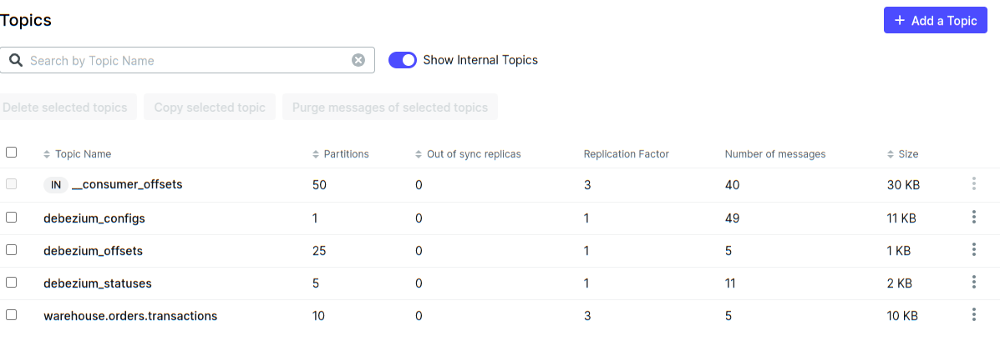

### День 4

#### Задание
Implement consistent transaction replication flow
- Deliver transactions from one database to another
- Maintain consistency in the face of every component outage
- Use queue or implement direct outbox-to-inbox

#### Схема 
Задача:
1. Имеется таблица с транзакциями принятия/списания товаров на складе.
2. Необходимо настроить передачу транзакций для консистентного ведения витрину остатков склада.

### Настройка окружения

##### 1. Поднятие Kafka+Debezium
Необходимо выполнить, чтобы поднять необходимые контейнеры
```shell
docker compose up -d
```

##### 2. Описание коннектора в Debezium

Создает описания коннектора в Debezium
```shell
./source-create.sh
```
Конфиг:
```json
{
  "name": "orders-connector",
  "config": {
    "connector.class": "io.debezium.connector.postgresql.PostgresConnector",
    "database.hostname": "db",
    "database.port": "5432",
    "database.user": "postgres",
    "database.password": "postgres",
    "database.dbname": "goods_db",
    "database.server.name": "warehouse",
    "plugin.name": "pgoutput",
    "table.include.list": "orders.transactions",
    "value.converter": "org.apache.kafka.connect.json.JsonConverter",
    "key.converter": "org.apache.kafka.connect.json.JsonConverter",
    "decimal.handling.mode": "double",
    "hstore.handling.mode": "json",
    "topic.prefix": "warehouse",
    "key.converter.schemas.enable": false,
    "value.converter.schemas.enable": false,
    "output.data.format": "JSON",
    "message.key.columns": "orders.transactions:id"
  }
}
```



#### 3. Добавление транзакций

```sql
INSERT INTO orders.transactions (id, good_id, operation, pcs, created_at) VALUES ('63703d1f-8dc5-40f0-ad66-79e45bbe7053', 1, 'add', 5, '2025-04-22 10:05:37.203030 +00:00');
INSERT INTO orders.transactions (id, good_id, operation, pcs, created_at) VALUES ('5d838899-14f4-4c29-9ee8-40c27657e09c', 2, 'add', 30, '2025-04-23 22:31:22.386164 +00:00');
INSERT INTO orders.transactions (id, good_id, operation, pcs, created_at) VALUES ('905ff7e7-0bcf-4da2-9e0b-d94373e194c9', 3, 'add', 1, '2025-04-23 22:45:04.020796 +00:00');
INSERT INTO orders.transactions (id, good_id, operation, pcs, created_at) VALUES ('78c14186-a33d-4569-a522-90175b6ce986', 2, 'remove', 15, '2025-04-23 22:46:39.496283 +00:00');

```


#### 4. Запуск консьюмера
```shell
 go run hw4
```

##### Пример работы консьюмера
```text
time=2025-04-24T14:22:59.949+03:00 level=INFO msg="Starting Kafka Brokers: " !BADKEY=localhost:29092,localhost:29093
2025/04/24 14:22:59 INFO Kafka broker list %+v !BADKEY=localhost:29092,localhost:29093
time=2025-04-24T14:22:59.950+03:00 level=INFO msg="immediate metadata update triggered" why="querying metadata for consumer initialization"
time=2025-04-24T14:22:59.953+03:00 level=INFO msg="beginning to manage the group lifecycle" group=go-group3
time=2025-04-24T14:22:59.953+03:00 level=INFO msg="joining group" group=go-group3
time=2025-04-24T14:22:59.957+03:00 level=INFO msg="join returned MemberIDRequired, rejoining with response's MemberID" group=go-group3 member_id=kgo-eb4cf35f-39db-440e-bb31-ce93292b3763
time=2025-04-24T14:23:02.960+03:00 level=INFO msg="joined, balancing group" group=go-group3 member_id=kgo-eb4cf35f-39db-440e-bb31-ce93292b3763 instance_id=<nil> generation=6 balance_protocol=cooperative-sticky leader=true
time=2025-04-24T14:23:02.960+03:00 level=INFO msg="balancing group as leader"
time=2025-04-24T14:23:02.960+03:00 level=INFO msg="balance group member" id=kgo-eb4cf35f-39db-440e-bb31-ce93292b3763 interests="interested topics: [warehouse.orders.transactions], previously owned: "
time=2025-04-24T14:23:02.960+03:00 level=INFO msg=balanced plan="kgo-eb4cf35f-39db-440e-bb31-ce93292b3763{warehouse.orders.transactions[0 1 2 3 4 5 6 7 8 9]}"
time=2025-04-24T14:23:02.960+03:00 level=INFO msg=syncing group=go-group3 protocol_type=consumer protocol=cooperative-sticky
time=2025-04-24T14:23:02.967+03:00 level=INFO msg=synced group=go-group3 assigned="warehouse.orders.transactions[0 1 2 3 4 5 6 7 8 9]"
time=2025-04-24T14:23:02.968+03:00 level=INFO msg="new group session begun" group=go-group3 added="warehouse.orders.transactions[0 1 2 3 4 5 6 7 8 9]" lost=""
time=2025-04-24T14:23:02.968+03:00 level=INFO msg="beginning heartbeat loop" group=go-group3
time=2025-04-24T14:23:02.972+03:00 level=INFO msg="assigning partitions" why="newly fetched offsets for group go-group3" how="assigning everything new, keeping current assignment" input="warehouse.orders.transactions[6{0 e-1 ce0} 2{-2 e-1 ce0} 0{0 e-1 ce0} 1{-2 e-1 ce0} 9{-2 e-1 ce0} 3{0 e-1 ce0} 7{0 e-1 ce0} 8{-2 e-1 ce0} 5{-2 e-1 ce0} 4{-2 e-1 ce0}]"
time=2025-04-24T14:23:02.984+03:00 level=INFO msg="Skip! Already seen transaction"
time=2025-04-24T14:23:03.003+03:00 level=INFO msg="Skip! Already seen transaction"
time=2025-04-24T14:23:03.011+03:00 level=INFO msg="Skip! Already seen transaction"
time=2025-04-24T14:23:03.016+03:00 level=INFO msg="Skip! Already seen transaction"
time=2025-04-24T14:25:23.042+03:00 level=INFO msg="Inserted 1 tx records"
time=2025-04-24T14:25:23.044+03:00 level=INFO msg="Inserted/updated 1 records"
```
В журнале демонстрируется работа консьюмера после сброса OFFSET для консьюмер группы и добавления новой транзакции при неработающем consumer.
Из лога видно, что консьюмер перечитывает журнал транзакций, проверяя была ли обработана транзакция ранее.
За счет сохранения в remains.transaction_log id транзакций consumer реализует ExactlyOnce паттерн доставки.

#### 5. Проверка
```sql
select * from remains.remains
```

|   | good_id | cnt |
|---|---------|-----|
| 1 | 1       | 5   |
| 2 | 3       | 1   |
| 3 | 2       | 10  |
